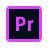

# HI👋
# I'm Junior Full Stack developer

<!--I learn and use-->

## I learn and use
 <section>

</section>

<!--tools-->
## Tools
<section>
  
<a href="https://code.visualstudio.com/" target="_blank">

 
</a>

<a href="https://www.adobe.com/products/premiere/free-trial-download.html" target="_blank">
 
 <a href="" target="_blank">
 
 <a href="https://obsproject.com/" target="_blank">

 </section>

<!--gif-->
<section>

  

</section>
