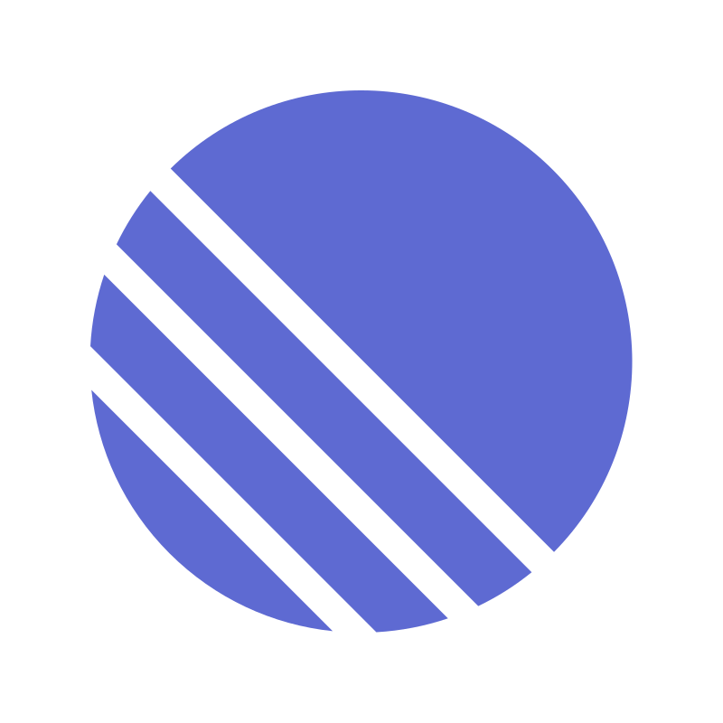

<p align="center">
  
</p>

<p align="center">
  <a href="https://git.io/typing-svg">
    
  </a>
</p>

## 💻 About Me
```typescript
const maksym: Developer = {
  location: "Lithuania 🇱🇹",
  role: "Frontend Developer",
  currentFocus: "Building AI-powered web applications",
  
  skills: {
    languages: ["TypeScript", "JavaScript"],
    frontend: ["React", "Next.js", "Vite", "Tailwind CSS", "Sass", "Framer Motion"],
    stateManagement: ["Zustand", "Redux Toolkit"],
    backend: ["Node.js", "MongoDB"],
    cloud: ["AWS", "Vercel"],
    tools: ["Git", "Docker", "Figma", "Postman", "Linear"]
  },
  
  lifePhilosophy: "Clean code & great user experience",
  
  dailyRoutine: () => {
    while (alive) {
      coffee();
      code();
      learn();
      repeat();
    }
  }
};
```

## 🛠 Tech Stack

<p align="center">
  
</p>

## ☁️ Cloud & DevOps

<p align="center">
  
</p>

## 🔧 Tools

<p align="center">
  
</p>

<p align="center">
  
  
  
  
  
  
</p>

<p align="center">
  
</p>